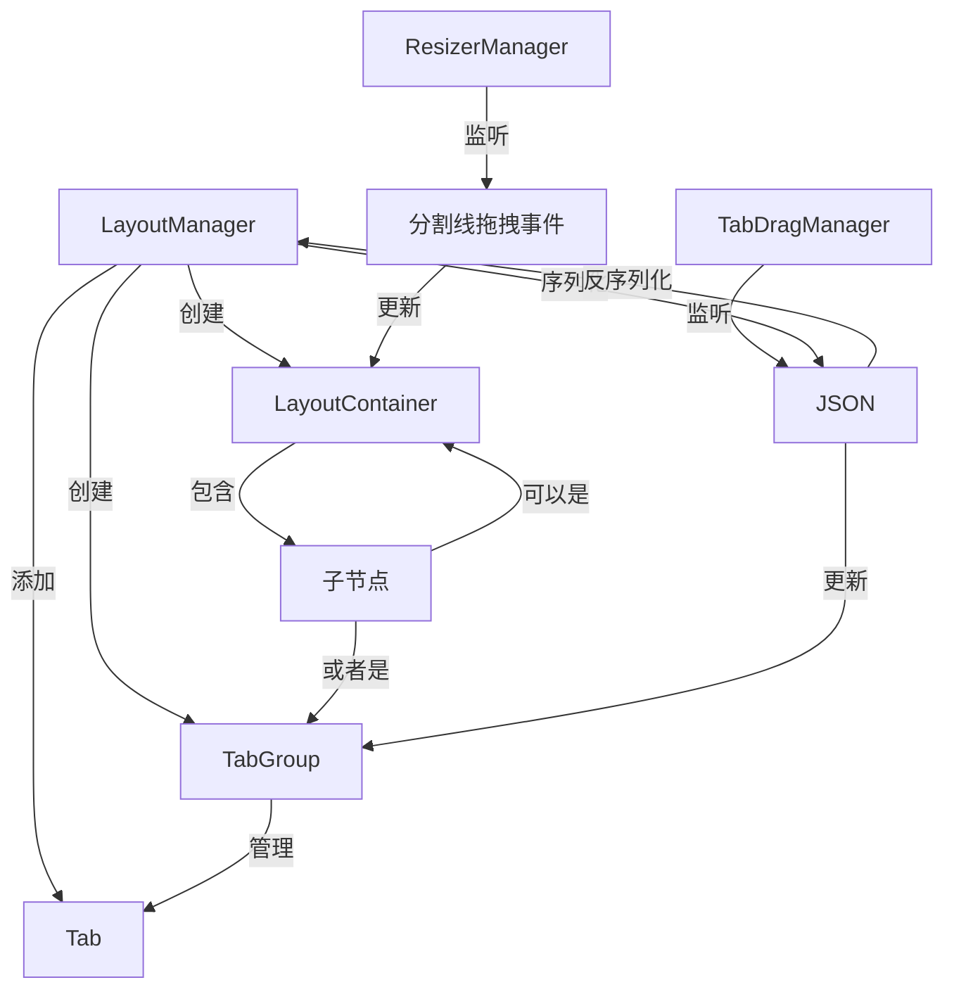

# Docking Layout System 实现规划文档

## 1. 核心目标

实现一个类似 IDE 或 Photoshop 的高自由度、可嵌套的标签页系统（Docking Layout System），支持 Row/Column 布局嵌套、标签组管理、分割线拖拽、标签重组等核心功能。

## 2. 架构设计与模块关系

### 2.1 模块描述

**核心模块划分**：
- `LayoutNode`：数据模型基类，定义树形节点结构
- `LayoutContainer`：容器节点，支持 Row/Column 布局，管理子节点尺寸比例
- `TabGroup`：标签组节点，可视化的最小内容单元，管理多个 Tab 和标签头位置
- `Tab`：纯数据对象，描述内容元数据（标题、内容组件、图标等）
- `LayoutManager`：布局管理器，负责布局树的创建、修改、序列化和反序列化
- `ResizerManager`：分割线拖拽管理器，处理容器尺寸比例调整
- `TabDragManager`：标签拖拽管理器，处理标签跨组移动和排序

### 2.2 逻辑流向



### 2.3 架构原则

**设计模式**：
- **组合模式（Composite Pattern）**：LayoutContainer 和 TabGroup 继承自 LayoutNode，形成统一树形结构
- **数据驱动视图**：Tab 纯数据对象与 UI 组件分离，通过 props 传递
- **单向数据流**：布局修改必须通过 LayoutManager，严禁直接修改布局树

**封装范式**：
- **依赖注入**：组件通过 props 接收数据和回调函数，不直接访问全局状态
- **接口隔离**：每个模块只暴露必要的公共方法（如 LayoutManager 的 `createContainer`、`splitContainer` 等）

**通信机制**：
- **发布/订阅模式**：使用 EventBus 进行跨模块通信（如 `layout:changed` 事件）
- **回调接口**：组件通过 emit 事件通知父组件（如 `@split`、`@close`）
- **数据流向**：LayoutManager -> LayoutNode -> Vue Components

**EventBus 实现细节**：
- 使用原生 EventTarget API，封装为全局单例
- 事件命名规范：使用 `namespace:action` 格式（如 `layout:changed`、`drag:start`、`tab:close`）
- 必须在组件 onUnmounted 时移除事件监听器，避免内存泄漏
- 实现示例（`utils/eventBus.ts`）：
```typescript
class EventBus {
  private eventTarget = new EventTarget()

  on(event: string, callback: (data: any) => void) {
    this.eventTarget.addEventListener(event, (e: any) => callback(e.detail))
  }

  off(event: string, callback: (data: any) => void) {
    this.eventTarget.removeEventListener(event, callback)
  }

  emit(event: string, data?: any) {
    this.eventTarget.dispatchEvent(new CustomEvent(event, { detail: data }))
  }
}

export const eventBus = new EventBus()
```

### 2.4 状态分层设计

**持久化业务状态**：
- LayoutNode 树形结构（存储在 LayoutManager 中）
- Tab 数据列表（标题、图标、内容组件引用）
- 布局配置（分割线位置、标签头位置）

**瞬态展示状态**：
- 分割线拖拽过程中的临时尺寸比例（由 DragManager 私有管理）
- 拖拽时的视觉反馈（拖拽预览、高亮提示）
- 当前激活的 Tab ID（由 TabGroup 组件本地管理）

## 3. 目录结构与变更清单

### 3.1 预期结构

```
src/renderer/src/
├── components/
│   ├── layout/
│   │   ├── LayoutContainer.vue        [新增] 布局容器组件
│   │   ├── TabGroup.vue               [重构] 标签组组件（基于现有 Tab.vue 改造）
│   │   ├── Resizer.vue                [新增] 分割线组件
│   │   └── TabHeader.vue              [新增] 标签头组件
│   ├── Tab.vue                         [废弃/删除] 简单标签页组件
│   └── ...
├── composables/
│   ├── useLayout.ts                    [新增] 布局管理 Composable
│   ├── useDrag.ts                      [新增] 拖拽管理 Composable
│   └── useTab.ts                       [新增] 标签管理 Composable
├── types/
│   └── layout.ts                       [新增] 布局相关类型定义
├── managers/
│   ├── LayoutManager.ts                [新增] 布局管理器
│   ├── ResizerManager.ts               [新增] 分割线拖拽管理器
│   └── TabDragManager.ts               [新增] 标签拖拽管理器
├── utils/
│   ├── eventBus.ts                     [新增] 事件总线
│   └── layoutUtils.ts                  [新增] 布局工具函数
├── views/
│   └── tabs/                           [保留] 现有标签内容组件
│       ├── AiChat/
│       │   └── index.vue
│       └── ...
└── App.vue                             [修改] 使用新的布局系统
```

### 3.2 变更状态

- `components/Tab.vue` [废弃删除]：功能迁移至 TabGroup.vue
- `components/layout/LayoutContainer.vue` [新增]：布局容器组件
- `components/layout/TabGroup.vue` [新增]：标签组组件
- `components/layout/Resizer.vue` [新增]：分割线组件
- `components/layout/TabHeader.vue` [新增]：标签头组件
- `composables/useLayout.ts` [新增]：布局管理 Composable
- `composables/useDrag.ts` [新增]：拖拽管理 Composable
- `composables/useTab.ts` [新增]：标签管理 Composable
- `types/layout.ts` [新增]：布局类型定义
- `managers/LayoutManager.ts` [新增]：布局管理器
- `managers/ResizerManager.ts` [新增]：分割线拖拽管理器
- `managers/TabDragManager.ts` [新增]：标签拖拽管理器
- `utils/eventBus.ts` [新增]：事件总线
- `utils/layoutUtils.ts` [新增]：布局工具函数
- `App.vue` [修改逻辑]：使用新的布局系统替代原有 Tab 组件

## 4. 技术契约与数据模型

### 4.1 核心数据结构

**LayoutNode 基类**（`types/layout.ts`）：
```typescript
interface LayoutNode {
  id: string                    // 唯一标识
  type: 'container' | 'group'   // 节点类型
  parentId: string | null       // 父节点 ID
}

interface LayoutContainer extends LayoutNode {
  type: 'container'
  direction: 'row' | 'column'  // 布局方向
  children: LayoutNode[]        // 子节点
  sizes: number[]               // 子节点尺寸比例（百分比，总和必须为 100）
}

interface TabGroup extends LayoutNode {
  type: 'group'
  tabs: Tab[]                   // 标签列表
  activeTabId: string | null    // 当前激活的标签 ID
  headerPosition: 'top' | 'bottom' | 'left' | 'right'  // 标签头位置
  isToolMode: boolean           // 是否工具模式（隐藏标签头）
}

interface Tab {
  id: string                    // 唯一标识
  title: string                 // 标题
  icon?: string                 // 图标（可选）
  closable: boolean             // 是否可关闭
  contentKey: string            // 组件注册表的 key（用于 JSON 序列化）
  contentProps?: Record<string, any>  // 内容组件的 props
}

// 组件注册表：在应用初始化时注册所有可用的内容组件
// 使用 Record<string, Component> 存储组件引用
// 示例：const componentRegistry: Record<string, Component> = { 'AiChat': AiChat, 'Settings': Settings }

### 4.2 核心接口定义

**LayoutManager 接口**（`managers/LayoutManager.ts`）：
```typescript
interface LayoutManager {
  // 布局创建
  createRoot(): LayoutContainer
  createContainer(direction: 'row' | 'column', parentId: string): LayoutContainer
  createTabGroup(parentId: string): TabGroup

  // 布局修改
  splitContainer(containerId: string, direction: 'row' | 'column', index: number): void
  removeNode(nodeId: string): void
  resizeContainer(containerId: string, sizes: number[]): void
  collapseContainer(containerId: string): void  // 容器折叠：当容器只剩一个子节点时，移除容器并提升子节点

  // 标签管理
  addTab(groupId: string, tab: Tab): void
  removeTab(groupId: string, tabId: string): void
  setActiveTab(groupId: string, tabId: string): void
  moveTab(fromGroupId: string, toGroupId: string, tabId: string, index?: number): void

  // 序列化
  toJSON(): string
  fromJSON(json: string): void

  // 事件订阅
  on(event: 'layout:changed', callback: (node: LayoutNode) => void): void
  off(event: string, callback: Function): void
}
```

**ResizerManager 接口**（`managers/ResizerManager.ts`）：
```typescript
interface ResizerManager {
  // 分割线拖拽
  startResize(containerId: string, resizerIndex: number): void
  onResize(delta: number): void
  endResize(): void
  isResizing: boolean  // 暴露状态，是否正在拖拽分割线
}
```

**TabDragManager 接口**（`managers/TabDragManager.ts`）：
```typescript
interface TabDragManager {
  // 标签拖拽
  startDragTab(groupId: string, tabId: string): void
  onDragOver(targetGroupId: string, position?: number): void
  onDrop(targetGroupId: string, position?: number): void
  cancelDrag(): void
  isDragging: boolean  // 暴露状态，是否正在拖拽标签
  draggingTabId: string | null  // 当前拖拽的标签 ID
}
```

**Composable 接口**（`composables/useLayout.ts`）：
```typescript
function useLayout(initialState?: string): {
  layout: Ref<LayoutNode | null>
  manager: LayoutManager
  createRoot: () => void
  split: (nodeId: string, direction: 'row' | 'column') => void
  remove: (nodeId: string) => void
  saveLayout: () => string
  loadLayout: (json: string) => void
}
```

## 5. 实现策略与前提

### 5.1 依赖拓扑

**第一层：基础类型和工具**（`types/layout.ts`、`utils/layoutUtils.ts`）
- 定义所有数据结构和类型
- 实现布局计算工具函数（如尺寸比例计算）

**第二层：管理器层**（`managers/LayoutManager.ts`、`managers/ResizerManager.ts`、`managers/TabDragManager.ts`）
- 实现布局树的管理逻辑
- 实现分割线拖拽状态管理
- 实现标签拖拽状态管理

**第三层：Composable 层**（`composables/useLayout.ts`、`composables/useDrag.ts`、`composables/useTab.ts`）
- 封装管理器为 Vue 响应式 API
- 提供组件级的使用接口

**第四层：组件层**（`components/layout/`）
- LayoutContainer.vue：使用 useLayout 和 useDrag
- TabGroup.vue：使用 useTab
- Resizer.vue：使用 useDrag
- TabHeader.vue：独立组件

**第五层：应用层**（`App.vue`）
- 使用 useLayout 创建和管理根布局

### 5.2 分析原则

**性能考虑**：
- 分割线拖拽使用 `requestAnimationFrame` 优化渲染性能
- 布局计算使用 CSS flexbox，避免复杂的 JavaScript 尺寸计算
- 大量标签时使用虚拟滚动（可选，后续优化）

**交互考虑**：
- 拖拽时提供视觉反馈（拖拽预览、高亮目标区域）
- 分割线拖拽限制最小/最大尺寸，防止布局崩坏
- 标签拖拽支持预览目标位置（插入点指示器）

**边界处理**：
- 标签组关闭最后一个标签时的处理（关闭标签组或显示空状态）
- 容器只剩一个子节点时的处理（自动折叠容器）
- 布局深度限制（防止过度嵌套）

## 6. 数据模型

### 6.1 JSON Schema

布局树可序列化为以下 JSON 格式：
```json
{
  "id": "root",
  "type": "container",
  "direction": "row",
  "parentId": null,
  "children": [
    {
      "id": "group-1",
      "type": "group",
      "parentId": "root",
      "tabs": [
        {
          "id": "tab-1",
          "title": "聊天页面",
          "closable": true,
          "contentKey": "AiChat"
        }
      ],
      "activeTabId": "tab-1",
      "headerPosition": "top",
      "isToolMode": false
    },
    {
      "id": "container-1",
      "type": "container",
      "direction": "column",
      "parentId": "root",
      "children": [...],
      "sizes": [50, 50]
    }
  ],
  "sizes": [50, 50]
}
```

**sizes 字段验证规则**：
- `sizes` 数组长度必须与 `children` 数组长度完全一致
- `sizes` 中每个值为百分比（0-100），总和必须为 100（允许浮点误差 0.01）
- 每个子节点的最小尺寸约束为 100px，最大尺寸约束为容器尺寸的 80%
- 反序列化时必须调用验证函数 `validateContainer(container: LayoutContainer): boolean`
- 验证函数实现示例（`utils/layoutUtils.ts`）：
```typescript
function validateContainer(container: LayoutContainer): boolean {
  if (container.children.length !== container.sizes.length) return false
  const sum = container.sizes.reduce((a, b) => a + b, 0)
  return Math.abs(sum - 100) < 0.01
}
```

### 6.2 数据流转

```
用户操作 → 组件事件 → Composable → Manager → 布局树更新
                      ↓
                  事件发布
                      ↓
              Vue 响应式更新 → UI 渲染
```

**示例流程**：用户拖拽分割线
1. 用户按下 Resizer 组件
2. Resizer 触发 `@dragStart` 事件
3. useDrag 接收事件，调用 ResizerManager.startResize()
4. ResizerManager 记录初始状态，进入拖拽模式
5. 用户移动鼠标，Resizer 触发 `@dragMove` 事件
6. useDrag 调用 ResizerManager.onResize(delta)
7. ResizerManager 计算新的尺寸比例，更新 LayoutContainer.sizes
8. LayoutManager 触发 `layout:changed` 事件
9. Vue 响应式系统检测到布局变化，重新渲染
10. 用户释放鼠标，Resizer 触发 `@dragEnd` 事件
11. useDrag 调用 ResizerManager.endResize()
12. 拖拽结束

## 7. 拆解原则与约束

### 7.1 代码风格

**强制要求**：
- 使用 TypeScript 的严格模式，所有类型必须明确定义
- 使用 `const` 声明变量，`let` 仅用于循环变量
- 禁止使用 `any` 类型，必须使用具体类型或 `unknown`
- 函数参数和返回值必须标注类型
- 使用箭头函数简化回调函数

**命名规范**：
- 组件使用 PascalCase（如 `LayoutContainer.vue`）
- Composable 使用 camelCase 且以 `use` 开头（如 `useLayout`）
- 类型接口使用 PascalCase（如 `LayoutContainer`）
- 私有方法使用 `_` 前缀（如 `_calculateSizes`）
- 事件名使用 kebab-case（如 `@drag-start`）

### 7.2 重构原则

**DOM 操作约束**：
- 所有 DOM 操作必须在组件内部完成，严禁跨组件直接操作 DOM
- 使用 Vue 的 ref 和模板引用代替 `document.getElementById`
- 拖拽时使用原生 Drag API 或鼠标事件，通过事件传递状态

**业务逻辑约束**：
- 业务逻辑必须在 Manager 或 Composable 中完成，组件只负责渲染和事件转发
- 组件不得直接修改布局数据，必须通过 emit 事件通知父组件
- 禁止在组件中使用全局变量，所有状态通过 props 或响应式变量管理

### 7.3 依赖关系约束

**依赖禁止**：
- Utils 模块不得依赖任何业务模块
- Managers 模块不得依赖 Composables
- 组件层不得直接访问 Managers，必须通过 Composables

**依赖允许**：
- Composables 可以依赖 Managers
- 组件可以依赖 Composables
- Managers 可以依赖 Utils

### 7.4 状态分层设计

**持久化业务状态**：
- 存储在 LayoutManager 中
- 使用 EventBus 通知状态变更
- 支持序列化和持久化

**瞬态展示状态**：
- 在组件内部使用 `ref` 或 `reactive` 管理
- 不触发持久化
- 拖拽过程中的临时状态必须由 DragManager 私有管理，严禁使用全局响应式系统

### 7.5 反过度设计红线

**禁止引入**：
- 禁止引入 Vuex 或 Pinia 等全局状态管理库
- 禁止引入 rxjs 等响应式流库
- 禁止使用复杂的观察者模式或事件总线（除必要的 EventBus 外）

**推荐使用**：
- Vue 3 的 Composition API（ref、reactive、computed）
- 原生 Drag API 或鼠标事件
- 简单的 EventBus（基于 Map 或 EventTarget）

## 8. 代码复用与存量处理

### 8.1 代码审计

**现有代码分析**：
- `Tab.vue`：简单标签页组件，功能有限，需要重构
- `AiChat/index.vue`：聊天界面，可以作为 Tab 的内容组件直接复用
- `base.css`：颜色变量系统完整，可以继续使用

### 8.2 三类划分

**直接迁移**：
- `AiChat/index.vue`：作为 Tab 的内容组件，无需修改
- `base.css`：颜色变量系统，无需修改
- `App.vue`：部分逻辑迁移至新的布局系统

**重构实现**：
- `Tab.vue`：功能迁移至 TabGroup.vue，原有样式和部分逻辑可以复用
  - Tab.vue 的 header 样式迁移至 TabHeader.vue
  - Tab.vue 的 content 样式迁移至 TabGroup.vue
  - Tab.vue 的关闭按钮逻辑迁移至 TabGroup.vue

**废弃删除**：
- `Tab.vue`：完全被 TabGroup.vue 替代

### 8.3 平滑策略

**数据适配**：
- 如果项目已有旧的 Tab 数据格式，提供 `migrateLegacyData()` 函数进行转换
- 旧版本布局 JSON 提供兼容层，自动升级为新格式

**双轨运行**：
- 旧 Tab.vue 暂时保留，标记为 `@deprecated`
- 新布局系统与旧系统并存，逐步迁移
- 确认稳定后删除旧代码

## 9. 技术基准与逻辑分解

### 9.1 基准确认

**技术限制**：
- Vue 3 + TypeScript + Vite
- 单文件运行（不依赖 Electron API）
- 支持 ES6+ 语法
- 不允许引入新的大型依赖库

**工具限制**：
- 禁用外部 UI 库（如 Element Plus、Ant Design Vue）
- 使用纯原生实现，避免复杂依赖

### 9.2 逻辑拆解

#### 9.2.1 分割线拖拽逻辑

**步骤**：
1. 用户按下分割线（Resizer 组件）
2. 记录初始鼠标位置和容器尺寸
3. 用户移动鼠标
4. 计算鼠标移动距离（delta）
5. 根据容器方向计算新的尺寸比例：
   - Row 布局：水平拖拽，计算宽度比例
   - Column 布局：垂直拖拽，计算高度比例
6. 应用最小/最大尺寸限制：
   - 每个子节点最小 100px
   - 每个子节点最大不超过容器尺寸的 80%
7. 更新 LayoutContainer.sizes 数组
8. 使用 `requestAnimationFrame` 优化渲染性能
9. 用户释放鼠标，结束拖拽

**伪代码**：
```typescript
function onResize(delta: number, containerElement: HTMLElement) {
  const container = getContainer(containerId)
  const index = currentResizerIndex

  // 边界检查：只有一个子节点时不应有分割线
  if (container.children.length <= 1) {
    return
  }

  // 获取容器实际尺寸（通过 DOM 或 props）
  const totalSize = container.direction === 'row'
    ? containerElement.offsetWidth
    : containerElement.offsetHeight

  // 计算新的尺寸比例
  const deltaPercent = (delta / totalSize) * 100

  const newSizes = [...container.sizes]
  newSizes[index] += deltaPercent
  newSizes[index + 1] -= deltaPercent

  // 应用限制（最小 100px，最大 80%）
  const minPercent = (100 / totalSize) * 100
  newSizes[index] = Math.max(minPercent, Math.min(80, newSizes[index]))
  newSizes[index + 1] = Math.max(minPercent, Math.min(80, newSizes[index + 1]))

  // 归一化，确保总和为 100
  const total = newSizes.reduce((a, b) => a + b, 0)
  newSizes = newSizes.map(s => (s / total) * 100)

  // 更新布局
  container.sizes = newSizes
  emit('layout:changed', container)
}
```

#### 9.2.2 标签拖拽重组逻辑

**步骤**：
1. 用户按下标签（TabHeader 组件）
2. 创建拖拽预览元素（cloneNode）
3. 用户移动鼠标
4. 高亮显示可放置的目标标签组
5. 计算拖拽位置（插入点或替换位置）
6. 显示插入点指示器
7. 用户释放鼠标
8. 调用 LayoutManager.moveTab()
9. 移除拖拽预览和指示器

**伪代码**：
```typescript
function onDrop(targetGroupId: string, position?: number) {
  // 1. 参数验证：源/目标相同检测
  if (sourceGroupId === targetGroupId) {
    console.warn('Cannot drag tab to same group')
    return
  }

  const sourceGroup = getGroup(sourceGroupId)
  const targetGroup = getGroup(targetGroupId)

  // 2. 参数验证：组 ID 有效性检测
  if (!sourceGroup || !targetGroup) {
    console.warn('Invalid group ID')
    return
  }

  const tab = sourceGroup.tabs.find(t => t.id === tabId)
  // 3. 参数验证：tab 不存在检测
  if (!tab) {
    console.warn('Tab not found')
    return
  }

  // 4. 位置有效性检测
  const maxPosition = targetGroup.tabs.length
  const safePosition = position !== undefined
    ? Math.max(0, Math.min(maxPosition, position))
    : maxPosition

  // 5. 从源标签组移除
  sourceGroup.tabs = sourceGroup.tabs.filter(t => t.id !== tabId)

  // 6. 添加到目标标签组
  targetGroup.tabs.splice(safePosition, 0, tab)

  // 7. 如果源标签组为空，关闭标签组
  if (sourceGroup.tabs.length === 0) {
    // 检查是否需要折叠容器
    const parentContainer = getContainer(sourceGroup.parentId)
    if (parentContainer && parentContainer.children.length === 1) {
      // 容器只剩一个子节点，自动折叠
      collapseContainer(parentContainer.id)
    } else {
      removeNode(sourceGroup.id)
    }
  }

  emit('layout:changed', targetGroup)
}
```

#### 9.2.3 标签头位置切换逻辑

**步骤**：
1. 用户右键点击标签头
2. 显示上下文菜单（位置选项：Top/Bottom/Left/Right）
3. 用户选择位置
4. 更新 TabGroup.headerPosition
5. 根据位置调整样式：
   - Top：标签头在顶部，内容在下方（默认）
   - Bottom：标签头在底部，内容在上方
   - Left：标签头在左侧，内容在右侧
   - Right：标签头在右侧，内容在左侧
6. 触发布局更新

**样式调整策略**：
- 使用 CSS Grid 或 Flexbox 动态调整布局方向
- Top/Bottom 使用 `flex-direction: column`
- Left/Right 使用 `flex-direction: row`

## 10. 开发路线规划

### 第一阶段：核心架构搭建

**目标**：建立布局系统的基础架构，实现树形布局的渲染。

**任务**：
1. 创建 `types/layout.ts`，定义所有数据结构
2. 创建 `managers/LayoutManager.ts`，实现布局树的创建和管理
3. 创建 `composables/useLayout.ts`，封装布局管理为 Vue 响应式 API
4. 创建 `components/layout/LayoutContainer.vue`，实现容器渲染
5. 创建 `components/layout/TabGroup.vue`，实现标签组渲染
6. 创建 `components/layout/TabHeader.vue`，实现标签头渲染
7. 修改 `App.vue`，使用新的布局系统替换原有 Tab 组件
8. 测试基础布局：创建根容器，添加标签组，渲染内容

**验收标准**：
- 能够创建 Row/Column 嵌套布局
- 能够在标签组中添加和显示标签
- 能够激活和切换标签
- 布局树能够正确渲染和更新

### 第二阶段：布局交互

**目标**：实现分割线拖拽和标签头功能。

**任务**：
1. 创建 `managers/ResizerManager.ts`，实现分割线拖拽状态管理
2. 创建 `managers/TabDragManager.ts`，实现标签拖拽状态管理
3. 创建 `composables/useDrag.ts`，封装拖拽逻辑
4. 创建 `components/layout/Resizer.vue`，实现分割线组件
5. 实现分割线拖拽调整尺寸比例
6. 实现标签头右键菜单（位置切换）
7. 实现标签关闭功能（双击、中键点击、右键菜单）
8. 实现工具模式（隐藏标签头）
9. 添加拖拽视觉反馈（拖拽预览、高亮提示）

**验收标准**：
- 能够拖拽分割线调整容器尺寸
- 能够通过右键菜单切换标签头位置
- 能够通过双击、中键点击、右键菜单关闭标签
- 能够切换工具模式，隐藏标签头
- 拖拽时有清晰的视觉反馈

### 第三阶段：动态管理

**目标**：实现布局的动态增删改和工具模式。

**任务**：
1. 实现 `LayoutManager.splitContainer()`，分割容器
2. 实现 `LayoutManager.removeNode()`，删除节点
3. 实现 `LayoutManager.addTab()`，添加标签
4. 实现 `LayoutManager.removeTab()`，删除标签
5. 实现 `LayoutManager.moveTab()`，移动标签（基础版本）
6. 实现布局持久化（JSON 序列化/反序列化）
7. 实现布局配置的本地存储（localStorage）
8. 添加布局预设功能（保存和加载多个布局）

**验收标准**：
- 能够通过分割操作将容器拆分为多个区域
- 能够删除容器和标签组
- 能够动态添加和删除标签
- 能够将布局序列化为 JSON 并保存到 localStorage
- 能够从 localStorage 加载布局并恢复

### 第四阶段：高级功能

**目标**：实现拖拽重组和自由画布功能。

**任务**：
1. 实现标签拖拽预览（cloneNode）
2. 实现拖拽目标高亮和插入点指示器
3. 完善 `LayoutManager.moveTab()`，支持跨组拖拽和排序
4. 实现拖拽边界检测（限制拖拽范围）
5. 实现拖拽取消（ESC 键或点击空白处）
6. 添加拖拽动画和过渡效果
7. 优化性能：大量标签时的虚拟滚动
8. 优化性能：拖拽时的 `requestAnimationFrame` 优化
9. 添加快捷键支持（如 Ctrl+W 关闭标签）
10. 添加布局重置功能（恢复默认布局）

**验收标准**：
- 能够拖拽标签到其他标签组
- 能够拖拽标签在组内排序
- 拖拽时有流畅的动画和过渡效果
- 大量标签时渲染性能良好
- 支持快捷键操作

## 11. 附录

### 11.1 参考

- [GoldenLayout](https://www.golden-layout.com/) - 开源 Docking Layout 库
- [Phosphor Icons](https://phosphoricons.com/) - 图标库（用于标签头图标）
- [Vue 3 Drag and Drop](https://github.com/vuejs/composition-api) - Vue 3 拖拽实现参考

### 11.2 注意事项

- 所有组件必须使用 TypeScript 严格模式
- 禁止使用 `any` 类型
- 所有公共接口必须有 JSDoc 注释
- 每个阶段完成后进行测试，确保功能正常
- 遵循 Vue 3 Composition API 最佳实践
- 使用 `ref` 和 `reactive` 管理状态，避免全局变量
- 使用 `computed` 优化派生状态
- 使用 `watch` 和 `watchEffect` 监听状态变化
